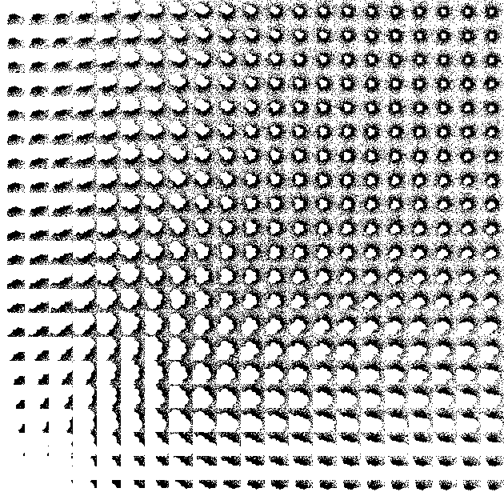

# Coal: Composition of Real Linear Functions

Begin with an example. Let *f: x ↦ x+1* and *g: x ↦ 2x*.
Let a word formed with *f* and *g* letters, for example *w="gfg"*.
By applying composition rules on *w*, we obtain for all *x*: 
*w(x)=gfg(x)=gf(2x)=g(2x+1)=4x+2*.
Slope is *4*, intercept is *2* and fixed point is *x=-2/3*.

This code automatizes composition of such linear functions.
When *f: x ↦ ax+b,* coefficients *a* and *b* can be formal letters, rational values or real values.
For rational values, gmp package is used to keep exact results.

## Motivating examples

### A functional way to count positive integers using two symbols
Let *f: x ↦ x+1* and *g: x ↦ 10x*.
Any positive integer *n* can be written as *w(1)* for some word *w* (unicity is not guaranteed).
For example: *3402 = ffggffffgff(1)*,

If we take instead *g: x ↦ 2x*,
we get something related to the binary representation of integers.

### Functions involved in Collatz conjecture
Let *f: x ↦ (1/3)x-1/3* and *g: x ↦ 2x*.
The [Collatz conjecture](https://en.wikipedia.org/wiki/Collatz_conjecture) considers composition of those linear functions 
(here when beginning with *1* and going up on the tree).

Important note: This repository does not provide any advance in that conjecture.
Before wasting time with it, make sure you can understand its underlying complexity, for example by reading carefully [this post](https://terrytao.wordpress.com/2011/08/25/the-collatz-conjecture-littlewood-offord-theory-and-powers-of-2-and-3). 

## Code examples
Minimal and detailed examples are provided in `main.R`.

*Example of data frame containing compositions*
 

*Fixed point of a random word with varying complex coefficients*

*Fixed point for word fg with different random coefficients*

*Fractional part of some fixed points*

## Documentation of functions

Each function is self-documented and contains unit tests.

### 1_linear_function.R
Code to define the `Linear function` class. A linear function contains the formal slope and intercept (as strings), and the related numeric slopes of intercepts (as a vector gmp numbers, since we can consider a whole range of slopes and intercepts together). We can do composition of linear functions with the `%o%` operator.

- `Linear function` (class): define a linear function with slopes and intercepts
- `initialize` (method)
- `f_base` (value): the function *f* for testing code.
- `g_base` (value): the function *g* for testing code.
- `id_n` (function)
- `is_defined_as_id` (function)
- `get_inverse` (function): Inverse function of a linear function
- `F_base` (value): inverse function *F* for testing code.
- `G_base` (value): inverse function *G* for testing code.
- `printf` (method)
- `split_coeff` (function)
- `poly_expansion` (function)
- `compo_formal` (function)
- `compo_numeric` (function)
- `compo` (method)
- `%o%` (function): composition of two linear functions
- `word2num` (function): convert word to **R**^{#word}, e.g. *fffgg* to *(2, 2, 1, 1, 1)*
- `linfun_init` (function): given *f* and *g* linear functions, get the linear function related to a specific word (not useful because we can use word tree class directly with some initialization)

### 2_evaluate_x.R
Evaluate a word of linear functions in some vector of values *x*. This is linked with the linear function class, and will be probably used only through the word tree class.

- `outer` (function)
- `rep_mat` (function)
- `compute_matrix_values` (function)
- `push_matrix_values` (function)
- `matrix_values_numeric` (function)
- `get_pos` (function)
- `to_integer_mat` (function)
- `is_NA_mat` (function)

### 3_word_tree.R
Define word tree class. An object of this class contains all information to perform compositions. Its main element is a dataframe with results on each (discrete) word.

- `Word tree` (class): define a word tree dataframe from voc, words_init, linfunc, x_init and x_integer_only
- `df_to_integer_df` (function)
- `initialize` (method)
- `add_letters` (function)
- `add_linfunc` (function)
- `add_values` (function)
- `push` (method): pushing one more letter
- `pushn` (method): pushing n more letters
- `signature_func` (function)
- `add_signature` (method): add the *(m, n)* of words as dataframe columns
- `add_coeffs` (method): add slope, intercept, fixed points as dataframe columns

### 4_word2coordinates.R
Convert words to vector of coordinates, i.e. not a single number but a vector. This is not directly related with the linear composition problem, but can be used after for trajectories.

- `voc_unique_func` (function)
- `voc_lower_func` (function)
- `voc_upper_func` (function)
- `voc2steps` (function)
- `walk_word` (function): define the path related to a word. This is useful to get trajectories of a word on the plane as a North-East path, this is done after.
- `coord_representation` (function)
- `coord_representation_n` (function)
- `compute_coord` (method): get a coordinate in a high dimension, this direction does not seems very good, because it is hard to work in this space, and no relation with the coefficients.

### 5_word2index.R
Convert words to index (as a natural number). This is not directly related with the linear composition problem, but can be useful to get an order on all the words.

- `word2index` (function): get a 'common' index of the words
- `add_common_index` (method): add this 'common' index to the dataframe of a word tree

### 6_random_words.R
Sample random words of a certain size.

- `random_word` (function)
- `random_words` (function)

### 7_plot_trajectories.R
Plot the trajectories of words. Only for toy purposes.

- `trajectory_word` (function): get the listing of the trajectory
- `trajectory_word_ready_to_plot` (function): just a helper function for plotting
- `plot_path_word` (function): plot the trajectory of a word
- `plot_path_multiple_words` (function): plot the trajectories of multiple words

### 8_plot_trees.R
Plot the trees of words. Only for toy purposes.

- `remove_first_charact` (function)
- `remove_last_charact` (function)
- `get_parents` (function): get parents of a word or of multiple words.
- `plot_tree` (function): lot the tree of a dataframe obtained with get_parents

### 9_continuous.R
Allow evaluation of continuous words. For example, how to go continuously from *fg* to *gfg*? A method is proposed for 2-letters compositions by representing each word as a probability distribution. The code is self-documented before `iota_vector`. After that, please contact me if you need to understand it in details. Main functions are `alpha`, `beta`, `x0` and `move`.

Example 1: We define a continuous road from *fg* to *gfg*: *g0fg*, *g0.1fg*, *g0.2fg* ..., *g0.9fg*, *gfg*. Each element *gxfg* is a linear function where slope is given by `alpha`; intercept by `beta`; fixed point by `x0`. 

Example 2: Given *gfg*, we can make a continuous road from *gfg* to *gfg* using `move` function: *gfg*, *g0.9fg1.1*, *g0.8fg1.2*, ..., *g0.1fg1.9*, *fgg*, *f0.9ggf0.1*, *f0.8ggf0.2*, ..., *f0.1ggf0.9*, *ggf*, *g0.9gfg0.1*, *g0.8gfg0.2*, ..., *g0.1gfg0.9*, *gfg*.

- `get_nb_without` (function)
- `get_pos_letter` (function)
- `prob_of` (function)
- `supp_of` (function)
- `get_eps` (function)
- `prob_supp_of` (function)
- `diff_gmp` (function)
- `prob_supp_inv_of` (function)
- `plot_distribution` (function)
- `iota_vector` (function)
- `puiss` (function)
- `bigterms1` (function)
- `bigterms2` (function)
- `sigma` (function)
- `bigterms_singular_left` (function)
- `bigterms_singular_right` (function)
- `sigma_singular` (function)
- `alpha` (function)
- `beta` (function)
- `x0` (function)
- `reordering` (function)
- `move` (function)
